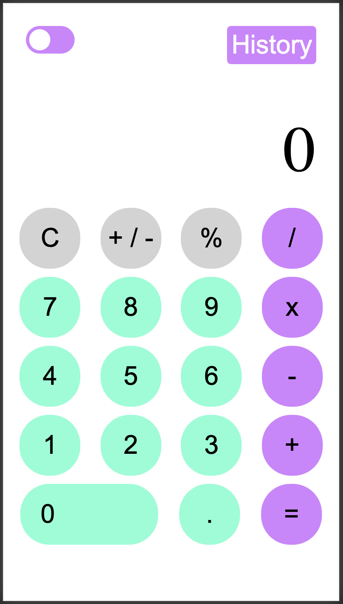

<!-- PROJECT SHIELDS -->
<!--
*** I'm using markdown "reference style" links for readability.
*** Reference links are enclosed in brackets [ ] instead of parentheses ( ).
*** See the bottom of this document for the declaration of the reference variables
*** for contributors-url, forks-url, etc. This is an optional, concise syntax you may use.
*** https://www.markdownguide.org/basic-syntax/#reference-style-links
-->
[![Contributors][contributors-shield]][contributors-url]
[![Forks][forks-shield]][forks-url]
[![Stargazers][stars-shield]][stars-url]
[![Issues][issues-shield]][issues-url]
[![MIT License][license-shield]][license-url]
[![LinkedIn][linkedin-shield]][linkedin-url]


<!-- PROJECT LOGO -->
<br />
<p align="center">
  <a href="https://github.com/victorgreco/calculator">
    
  </a>

  <h3 align="center">Calculator</h3>

  <p align="center">
    Nice set of calculators developed for several environment such as Web, Laptop and Mobile Native.  
    <br />
    <a href="https://github.com/victorgreco/calculator"><strong>Explore the docs »</strong></a>
    <br />
    <br />
    <a href="https://github.com/victorgreco/calculator">View Demo</a>
    ·
    <a href="https://github.com/victorgreco/calculator/issues">calculatorrt Bug</a>
    ·
    <a href="https://github.com/victorgreco/calculator/issues">Request Feature</a>
  </p>
</p>


<!-- TABLE OF CONTENTS -->
## Table of Contents

* [About the Project](#about-the-project)
  * [Web Calculator](#web-calculator)
* [Getting Started](#getting-started)
  * [Prerequisites](#prerequisites)
  * [Installation](#installation)
* [Usage](#usage)
* [Roadmap](#roadmap)
* [Contributing](#contributing)
* [License](#license)
* [Contact](#contact)


<!-- ABOUT THE PROJECT -->
## About The Project
The goal of this project is to deliver a multi-platform solution for a simple calculator using the right programming language for each platform keeping in mind the look and feel and the functionalities should be always the same.

[![Product Name Screen Shot][product-screenshot]]()

## Web Calculator


### Built With

* [JavaScript]()
* [HTML 5]()
* [CSS 3]()

<!-- GETTING STARTED -->
## Getting Started

To get a local copy up and running follow these simple steps.

### Prerequisites

Have a browser which supports **CSS3** and **JavaScript** like chrome. Most of modern browser does.

### Installation

1. Clone the calculator
```sh
git clone https://github.com/victorgreco/calculator.git
```

2. Open `index.html` on the browser
```sh
cd calculator
open vanilla-web/index.html
```

<!-- USAGE EXAMPLES -->
## Usage

Once you have the `index.html` open on your favorite browser you will see something like:



**CONGRATULATIONS !** You opened the calculator on the browser.

Now you can start doing operations !

You will find different operators available:

* `+` : Addition will add the first number to the second one. `NUM1 + NUM2`
* `-` : Subtraction will subtract the  selected numbers. `NUM1 - NUM2`
* `x` : Multiplication will multiply the chosen numbers. `NUM1 * NUM2`
* `/` : Division will divide the numbers giving a decimal number if necessary. `NUM1 / NUM2`
* `%` : Performs the percentage of the numbers. `NUM1 * NUM 2 / 100`
* `.` : Will add the decimal dot to the giving number.
* `C` : It resets the calculator so you can perform a new operation.
* `0-9` : Are the values you can use as input in order to make an operation.
* `=` : Performs the operation in the  calculator.

In order to perform the operation you have to follow this order:

1. Type any numbers, decimal, sign to set the first value `NUM1`.
2. Type the operator you want to use. Any of `+`, `-`, `x`, `/`, `%`.
3. Type any numbers, decimal, sign to set the first value `NUM2`.
4. Type the equal sign in order to perform  the operation.  

### History:


<br>

### Toggle Mode:


<br>

### **Dark Mode**


<br>


<!-- ROADMAP -->
## Roadmap

See the [open issues](https://github.com/victorgreco/calculator/issues) for a list of proposed features (and known issues).


<!-- CONTRIBUTING -->
## Contributing

Contributions are what make the open source community such an amazing place to be learn, inspire, and create. Any contributions you make are **greatly appreciated**.

1. Fork the Project
2. Create your Feature Branch (`git checkout -b feature/AmazingFeature`)
3. Commit your Changes (`git commit -m 'Add some AmazingFeature'`)
4. Push to the Branch (`git push origin feature/AmazingFeature`)
5. Open a Pull Request


<!-- LICENSE -->
## License

Distributed under the MIT License. See `LICENSE` for more information.


<!-- CONTACT -->
## Contact

Victor Greco - [linkedin](https://www.linkedin.com/in/victor-greco/) - victorgreco263@gmail.com

Project Link: [https://github.com/victorgreco/calculator](https://github.com/victorgreco/calculator)


<!-- MARKDOWN LINKS & IMAGES -->
<!-- https://www.markdownguide.org/basic-syntax/#reference-style-links -->
[contributors-shield]: https://img.shields.io/github/contributors/victorgreco/calculator.svg?style=flat-square
[contributors-url]: https://github.com/victorgreco/calculator/graphs/contributors
[forks-shield]: https://img.shields.io/github/forks/victorgreco/calculator.svg?style=flat-square
[forks-url]: https://github.com/victorgreco/calculator/network/members
[stars-shield]: https://img.shields.io/github/stars/victorgreco/calculator.svg?style=flat-square
[stars-url]: https://github.com/victorgreco/calculator/stargazers
[issues-shield]: https://img.shields.io/github/issues/victorgreco/calculator.svg?style=flat-square
[issues-url]: https://github.com/victorgreco/calculator/issues
[license-shield]: https://img.shields.io/github/license/victorgreco/calculator.svg?style=flat-square
[license-url]: https://github.com/victorgreco/calculator/blob/master/LICENSE.txt
[linkedin-shield]: https://img.shields.io/badge/-LinkedIn-black.svg?style=flat-square&logo=linkedin&colorB=555
[linkedin-url]: https://www.linkedin.com/in/victor-greco/
[product-screenshot]: images/screenshot.png